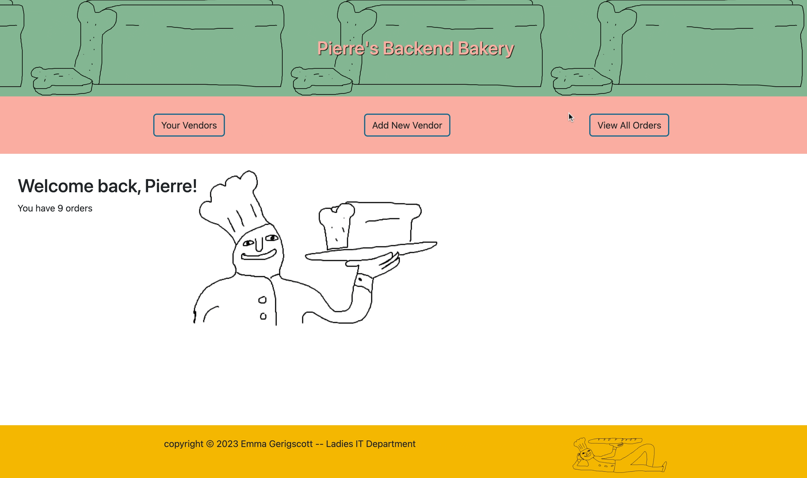

# Pierre's Backend Bakery

### By Emma Gerigscott



## Description

Welcome back, Pierre, to the backend of your bakeshop! Add new vendors, see all your orders, or view each vendor's info and order list. This program was written in C#, ASP.NET Core, and MVC.

## Technologies Used

* C#
* .NET
* ASP.NET Core
* MVC
* Microsoft Tests

## Setup Instructions

1. Clone this repo.
2. Open your terminal (e.g. Terminal or GitBash) and navigate to this project's directory called "Bakery".
3. To compile and view the webpage, in the command line in the directory "Bakery", run:
```
$ dotnet run
```
4. Optionally, you can run "dotnet build" to compile this webpage without running it.
5. If you'd like to run tests, navigate to the Bakery.Tests directory in your command line.
6. To run tests, in your command line from Bakery.Solution/Bakery.Tests, run:
```
$ dotnet test
```

## Known Bugs

* _Missing delete functionality_

## License
[MIT](https://opensource.org/licenses/MIT)  
Copyright © 2023 Emma Gerigscott